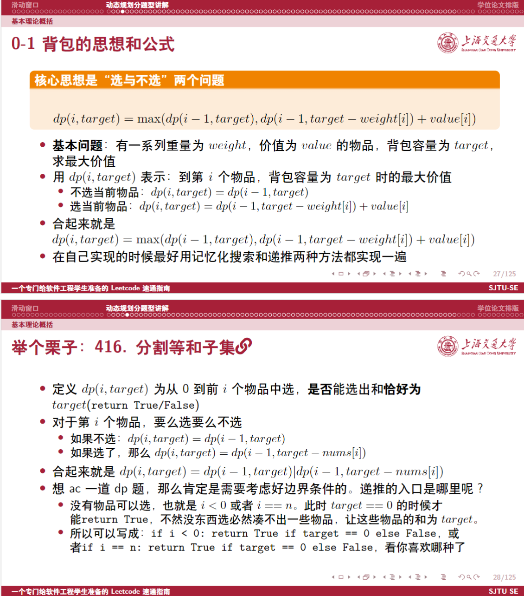
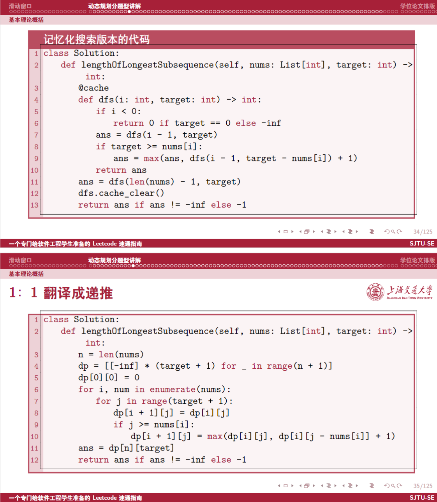

# Quickly-Leetcode-Tutorial 🤓

[](https://www.texpage.com/template/c0decdfd-ca66-4f4a-807d-5217f729dcfa)
[](https://www.overleaf.com/latex/templates/sjtubeamer/dgvrnpndrtjh)
[](https://github.com/sjtug/SJTUBeamer/discussions)
[](https://github.com/sjtug/SJTUBeamer/actions/workflows/build.yml)

这个模板是我在SJTUBeamer的基础上改的，感谢 [@SJTUG](https://github.com/SJTUG) 🥳

## 快速上手 👋
#### 写在前面
1. 为什么我即使受过软件学院的系统训练~~毒打~~，依旧选择`python3`而不是`c++`作为我的leetcode刷题主要语言呢？
    - 因为我曾经遇到了一段刷题瓶颈期，无论我怎么刷题也无法突破，这让我极度苦恼。我尝试寻求突破，正好我看到了[灵茶山艾府](https://github.com/EndlessCheng)的题单，他的题单质量很高而且他的题解很多都用`python`写的，我尝试跟着他的题单题解刷题，我也觉得用`python3`刷题比用`c++`刷题更适合leetcode
2. 我为什么依然要更新这个题解，即使leetcode有众多先人的资料？
    - 因为我根据我身边的观察发现，说实在话软件学院的学生很多算法题写的很一般而且偏弱。抛开软院课程压力大让很多人没业余时间刷题这个因素，我也觉得我需要做一份资料最大限度整合资源让大家能过快速上手刷题，根据一类知识点稳过一类题，尽量减少大家踩坑的时间。*而且灵神也有很多题解是上古时期的(bushi)或者没有题解*，这就可以让我来整理一下题解了
3. 我的一些代码展示。Talk is cheap, show me your code。我自己的感觉是不要畏惧对一个语言的语法不熟，语法不熟可以看别人~~比如我~~写的，或者问chatgpt🤖很容易上手的。实测只需要跟着gpt和灵神的题解半个月就能熟练用`python3`刷题了

<details>

<summary>如果0-1背包我用python3写</summary>

```python
class Solution:
    def canPartition(self, nums: List[int]) -> bool:
        @cache
        def dfs(i: int, target: int) -> bool:
            if i < 0:
                return True if target == 0 else False
            ans = dfs(i - 1, target)
            if target >= nums[i]:
                ans = ans | dfs(i - 1, target - nums[i])
            return ans
        s = sum(nums)
        if s & 1 == 1:
            return False
        
        ans = dfs(len(nums) - 1, s // 2)
        dfs.cache_clear()
        return ans
```

</details>

<details>

<summary>但是这是我以前用C++写的代码</summary>

```cpp
class Solution {
public:
    int findTargetSumWays(vector<int>& nums, int target) {
        int sum = 0;
        for (int num : nums) {
            sum += num;
        }
        if (sum % 2 != target % 2) {
            return 0;
        }
        int W = (sum + target) / 2;
        if (W < 0) {
            return 0;
        }
        int n = nums.size();
        vector<vector<int>> dp(W + 1, vector<int>(n + 1));
        dp[0][0] = 1;
        for (int j = 1; j <= n; j++) {
            for (int w = 0; w <= W; w++) {
                dp[w][j] = dp[w][j - 1];
                if (w >= nums[j - 1]) {
                    dp[w][j] += dp[w - nums[j - 1]][j - 1];
                }
            }
        }
        return dp[W][n];
    }
};
```

</details>


## 使用方法 🧰

我这里已经用超链接/链接将所有的资料/题目都放在pdf里了，开箱即用。如果你也想编辑pdf帮我贡献的话，那么下面就是SJTUBeamer的使用方式了

### 模版下载与编译

* TeXPage/Overleaf
  * 直接使用 [TeXPage 模板库链接](https://www.texpage.com/template/c0decdfd-ca66-4f4a-807d-5217f729dcfa)/[Overleaf 模板库链接](https://www.overleaf.com/latex/templates/sjtubeamer/dgvrnpndrtjh)。
  * 或者手动上传至 TeXPage/Overleaf 使用：
    * 下载开发版压缩包。页面右上角 Code - Download Zip 即可。
    * 或下载 [最新版](https://github.com/sjtug/SJTUBeamer/releases) 压缩包，点击 “Source Code (zip)” 即可下载。
    * 或下载 [最新版](https://github.com/sjtug/SJTUBeamer/releases) 最小依赖压缩包，点击 `sjtubeamer-online.zip` 下载。
    * 上传至 TeXPage/Overleaf。
    * TeXPage/Overleaf 的设置中需要选择“XeLaTeX”编译器编译。
* 本地使用
  * 安装 TeXLive 套件。
  * 下载模板至本地：
    * 使用 git 克隆仓库 `git clone https://github.com/sjtug/SJTUBeamer/` 或 `git clone https://mirror.sjtu.edu.cn/git/SJTUBeamer.git/`。
    * 或下载开发版压缩包。页面右上角 Code - Download Zip 即可。
    * 或下载 [最新版](https://github.com/sjtug/SJTUBeamer/releases) 压缩包。点击 “Source Code (zip)” 即可下载。
  * 之后通过 `latexmk -xelatex main.tex` 命令进行编译即可。
  * VSCode 用户可以使用 LaTeX Workshop 中的 “Recipe: latexmk (latexmkrc)” 进行编译。

目前模版最新的稳定版是 v3.1.0。您可以在 [发布页](https://github.com/sjtug/SJTUBeamer/releases) 查看修改日志和更多资料。通常来说，SJTUBeamer 的一个稳定版本包括如下内容：

* `sjtubeamerquickstart.pdf`：SJTUBeamer 快速入门，另见对应 [源代码](https://github.com/sjtug/SJTUBeamer/blob/main/src/doc/sjtubeamerquickstart.tex)。
* `sjtubeamer.pdf`: **强烈推荐在使用前阅读一遍 👍👍👍** SJTUBeamer 用户文档。
* `sjtubeamerdevguide.pdf`: SJTUBeamer 开发指南。
* `sjtulib-talk-max-red.pdf`: 示例文档《如何使用 LaTeX 排版论文》的 `max,red` 主题版本。
* `sjtulib-talk-maxplus-blue.pdf`: 示例文档《如何使用 LaTeX 排版论文》的 `maxplus,blue` 主题版本。
* `sjtulib-talk-maxplus-red.pdf`: 示例文档《如何使用 LaTeX 排版论文》的 `maxplus,red` 主题版本。
* `sjtulib-talk-min-red.pdf`: 示例文档《如何使用 LaTeX 排版论文》的 `min,red` 主题版本。
* `sample-all-covers.pdf`: 所有配色主题的封面封底。
* `sjtubeamer-ctan.zip`: 包含所有文档和样式的压缩包。
* `sjtubeamer-online.zip`：包含插件与最小依赖，适合于在线平台使用。
* SJTUBeamer 源代码。

请使用 Chrome 浏览器或 Adobe Acrobat 打开 SJTUBeamer 用户文档，以避免 PDF 兼容性导致的显示问题。

## 使用反馈与贡献代码 👷

* 文件清单详见 [MANIFEST](src/MANIFEST.md)。
* 在使用过程中，您可以在 [GitHub Discussions](https://github.com/sjtug/SJTUBeamer/discussions) 讨论区提问任何使用上的问题、交流想法。
* 在开发过程中，您可以通过 [GitHub Issues](https://github.com/sjtug/SJTUBeamer/issues) 提供 SJTUBeamer 的 Bug 反馈和新功能提案。同时，也欢迎您直接提交 [Pull Request](https://github.com/sjtug/SJTUBeamer/pulls) 代码修改帮助我们改进。
* 所有对模版的修改应该在 `.dtx` 文件中进行，而后用 l3build 生成 sty 文件。
* 您可以阅读发布页面中的《SJTUBeamer 开发指南》`sjtubeamerdevguide.pdf` 了解模版的实现细节与编译方法。

整个开发流程如下：

* 修改 `.dtx` 文件。
* 运行 `make generate` 将生成的 sty 文件拷贝到根目录下。
* 更新 `main.tex`，运行 `make build` 查看模版修改后的效果。
* 更新开发文档，运行 `make build-dev` 编译所有开发文档，运行单元测试。
* （可选）运行 `make format-dev` 格式化所有文件。
* 发 PR。

新贡献者可以将自己的信息加入 `src/doc/sjtubeamerdevguide.tex` 的 `Developer` 章节。

## 展示 🧐

详细展示见 [样式一览](https://github.com/sjtug/SJTUBeamer/discussions/138)。

<picture>
  
</picture>
    
<picture>
  
</picture>

## 许可证

SJTUBeamer 仓库同时包含 SJTUBeamer 包和一个示例文档。其中内容的许可证各不相同。您可以阅读各个文件的开头部分，了解该文件所使用的许可证。

* SJTUBeamer 包使用的许可证为 Apache-2.0。
* SJTUBeamer 示例文档使用 CC-BY-SA 4.0 许可。
* sjtuvi 和 sjtucover 库及其附属徽标、图片由上海交通大学持有版权。校属各单位及个人以经营为目的使用视觉形象识别系统，须向学校申请使用许可。校外单位及个人未经许可，不得制作或使用载有视觉形象识别系统的物品。您可以在 [vi.sjtu.edu.cn](https://vi.sjtu.edu.cn/index.php/articles/bulletin/16) 阅读许可协议。
